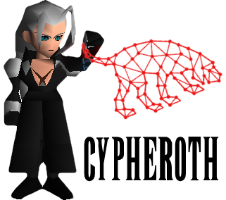

# Cypheroth
 Automated, extensible toolset that runs cypher queries against Bloodhound's Neo4j backend and saves output to spreadsheets.


<p align="center">
  
</p>


### Description

This is a bash script that automates running cypher queries against Bloodhound data stored in a Neo4j database.

I found myself re-running the same queries through the Neo4j web interface on multiple assessments and figured there must be an easier way. 😅

The list of cypher queries to run is fully extensible. The formatting example below shows how to add your own.

Please share any additional useful queries so I can add them to this project!

*Fully tested to be working in Bash on Linux, macOS, and Windows*

### Prereqs

* The `cypher-shell` command comes bundled with Neo4j, and is required for this script to function
  * _If Neo4j is installed and `cypher-shell` is not found, you may have an outdated version of Neo4j_
  * _The latest version can always be found at [this location](https://neo4j.com/download-center/)_
  * _On Kali, upgrade to the latest version using [Neo4j's Debian repository](https://debian.neo4j.org)_
* Optional: If the `ssconvert` command is present, the script will combine all .csv output to sheets within a .xls file
  * _Install the gnumeric toolset with apt or brew to gain access to ssconvert_

### Usage

Flags:

-u	Neo4J Username (Required)

-p	Neo4J Password (Required)

-d	Fully Qualified Domain Name (Required) (Case Sensitive)

-a	Bolt address (Optional) (Default: localhost:7687)

-t  Query Timeout (Optional) (Default: 10) (Measured in Seconds)

-v  Verbose mode (Optional) (Default:FALSE)

-h	Help text and usage example (Optional)

Example with Defaults:

  `./cypheroth.sh -u neo4j -p BloodHound -d TESTLAB.LOCAL`

Example with All Options:

  `./cypheroth.sh -u neo4j -p BloodHound -d TESTLAB.LOCAL -a 10.0.0.1:7687 -t 10 -v true`


Files are added to a subdirectory named after the FQDN."

### Cypher Queries

There are nearly 60 queries in the script currently. This is a sample of the information you'll receive:

* Full User Property List
* Full Computer Property List
* Full Domain Property List
* Full OU Property List
* Full GPO Property List
* Full Group Property List
* Computers with Admins
* Computers without Admins
* Kerberoastable users and computers where they are admins

To add additional queries, edit the `queries` array within cypheroth.sh and add a line using the following format:

`Description;Cypher Query;Output File`

*If adding a query that requires the Domain value to be set, save it as $DOMAIN.*

Example 1:
```
All Usernames;MATCH (u:User) RETURN u.name;usernames.csv
```

Example 2:
```
All Domain Admins;MATCH (u:User) MATCH (g:Group {name:'DOMAIN ADMINS@$DOMAIN'}) RETURN u.displayname;domainAdmins.csv
```

### Troubleshooting

If you are running an oudated version of `cypher-shell` you may receive the following error:

```
DateTime is not supported as a return type in Bolt protocol version 1.
Please make sure driver supports at least protocol version 2.
Driver upgrade is most likely required.
```

To fix, [update Neo4j](https://neo4j.com/download-center/) to the latest version.

### Author
Chris Farrell ([@seajay](https://twitter.com/seajay))

### Acknowledgments

* This tool wouldn't exist without BloodHound - developed by [@_wald0](https://twitter.com/_wald0), [@CptJesus](https://twitter.com/CptJesus), and [@harmj0y](https://twitter.com/harmj0y).
* Shoutout to the [Bloodhound Slack](https://bloodhoundgang.herokuapp.com) `#cypher_queries` channel for assistance
* Big ups to [@TinkerSec](https://twitter.com/TinkerSec) - the bones of this project were straight up copy/pasted from his [procdump script](https://github.com/tinkersec/scratchpad/blob/master/BashScripts/grabDump.sh) 🙃
* Many thanks to [@awsmhacks](https://twitter.com/awsmhacks) and [@haus3c](https://twitter.com/haus3c) for collecting useful cypher queries ([here](https://github.com/awsmhacks/awsmBloodhoundCustomQueries) and [here](https://hausec.com/2019/09/09/bloodhound-cypher-cheatsheet/))
* Hugely appreciate contributions from [@chryzsh](https://twitter.com/chryzsh)!!
